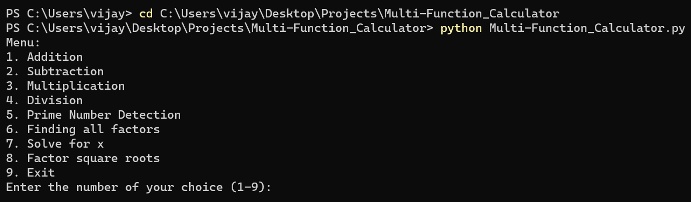
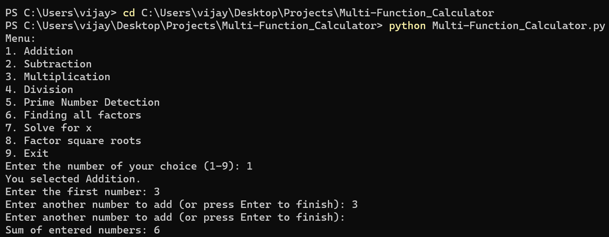
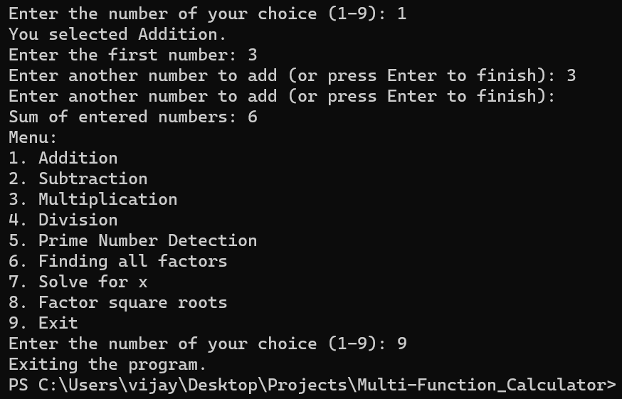

<h1>Multi-Function Calculator</h1>

<h2>Description</h2>
This program is a versatile mathematical utility with a user-friendly menu interface. It offers a range of mathematical operations, including basic arithmetic (addition, subtraction, multiplication, division), prime number detection, factorization, algebraic equation solving, and simplifying square roots. Users can choose the desired mathematical task from the menu, making it a valuable tool for a wide range of mathematical calculations and problem-solving needs.
 

<h2>Languages and Utilities Used</h2>

- <b>Python</b>

<h2>Environments Used </h2>

- <b>Windows 11</b>
- <b>Visual Studio Code</b>

<h2>Program walk-through:</h2>

Launch the file:  

 
 

Choose an operation from the list in the menu and input the numbers for the calculation:   

 
 

Choose another operation from the menu or enter 9 to exit the program:  

 
 
